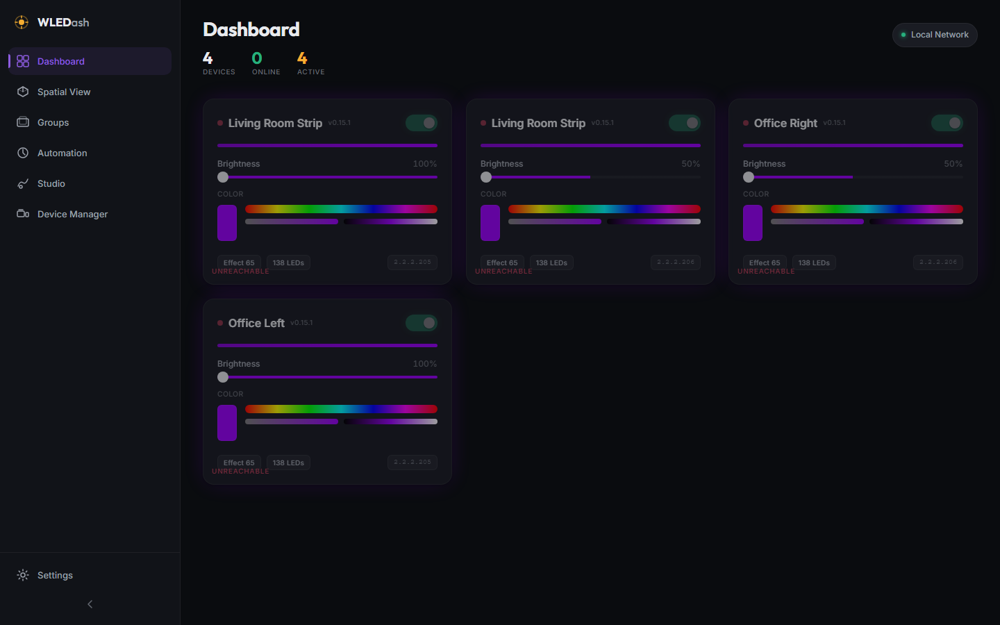
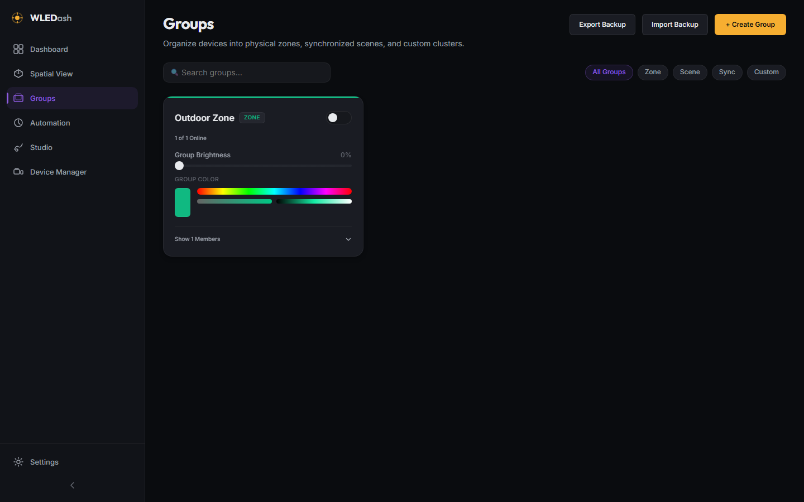
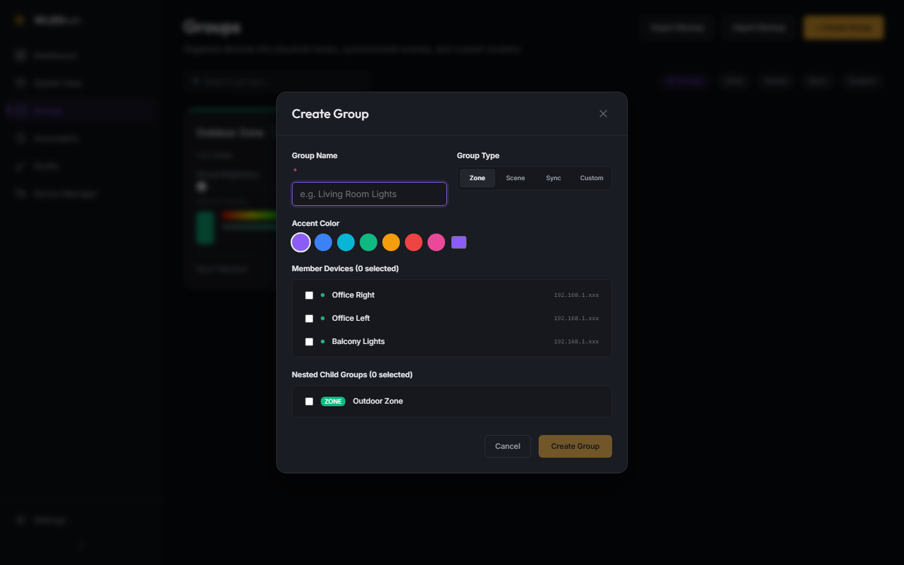
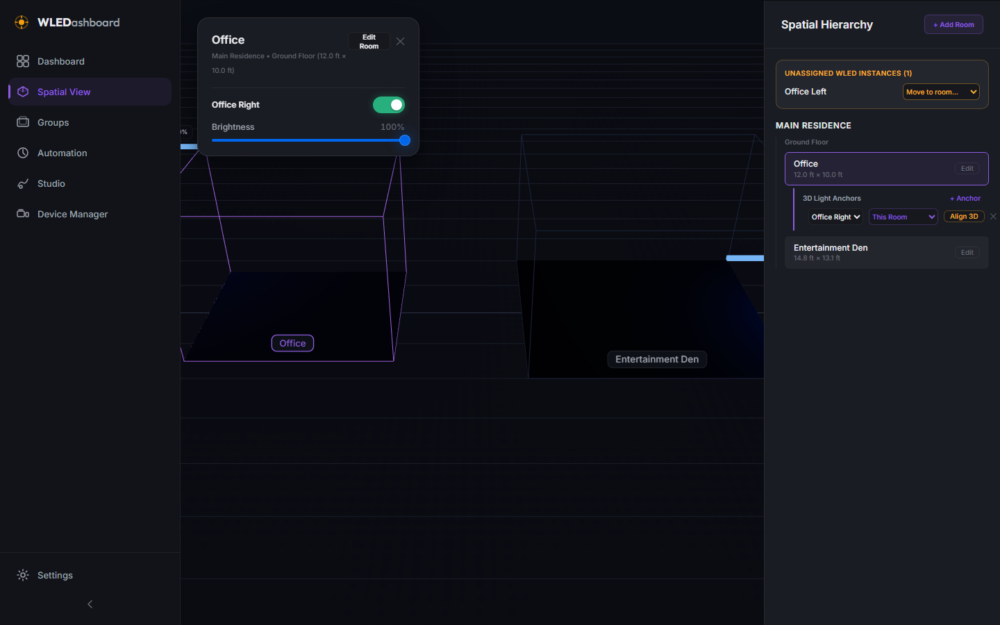
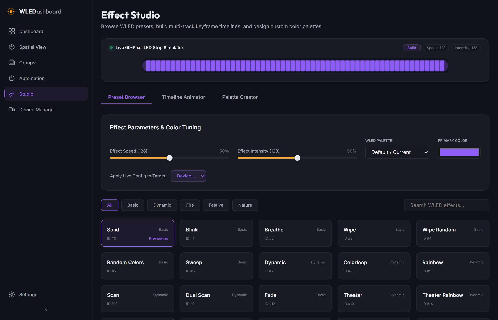

# WLEDashboard

A high performance, local first control surface for WLED devices. Control 1 to 100 or more LED controllers from a single responsive interface with spring physics animations, group management, and automatic mDNS network discovery.

---

## UI Highlights

### Dashboard

Control all your WLED devices with real time power toggles, dynamic brightness sliders with responsive color glow, compact inline color pickers, and live LED segment previews.



### Group Management

Organize devices into physical zones, synchronized scenes, and custom lighting clusters. Control group power, group brightness, and group colors simultaneously with automatic device command distribution.



### Group Editor Modal

Easily build and customize lighting groups with custom color palettes, group type classifications (Zone, Scene, Sync, Custom), device member selection, and nested child group clustering.



### Automation & Schedules

Automate lighting based on fixed times or astronomical sunrise/sunset triggers (`suncalc`). Build multi-step routine timelines with custom delay intervals between step actions.

### 3D Spatial Viewport

Experience your lighting in 3D space with Three.js / React Three Fiber. View procedural room geometries, wireframe wall bounds, and real-time emissive LED light strips that pulse and glow matching actual device color and brightness.



### Effect Studio & Timeline Animator

Browse WLED built-in effect catalogs, build custom multi-track keyframe animation timelines, design multi-stop color gradients, and simulate light patterns on a live 60-pixel LED strip canvas.



---

## Core Features

* **Local First Architecture**: SQLite storage with WAL journal mode. Zero cloud dependency, zero external account required, all data stays on your local network.
* **Automatic Device Discovery**: mDNS network scanning (`_wled._tcp`) automatically discovers WLED controllers on your local network and populates MAC addresses, firmware versions, and LED counts.
* **3D Spatial Viewport**: WebGL 3D canvas powered by Three.js & React Three Fiber. Render 3D floor plans, spatial light anchors, and real-time emissive light strip meshes.
* **Spring Physics Motion**: Dynamic damped harmonic oscillator spring engine drives interactive UI controls, toggle switches, hover elevations, and card transitions.
* **Group Management & Nesting**: Organize controllers into Zone, Scene, Sync, or Custom groups. Support for nested child groups and concurrent group command execution.
* **Automation & Schedules Engine**: Astronomical sunrise/sunset calculations (`suncalc`), time-based schedules, step-by-step routine timelines, and a 30s background scheduler loop.
* **Dashboard Group Clustering**: Instant toggle between individual device grid view and group cluster cards for high density setups.
* **JSON Configuration Backup**: Full export and import capabilities for backing up, restoring, or transferring dashboard state and device configurations.
* **Fastify & WebSocket Backend**: Fast Node.js API server with low latency WebSocket connection pushing live WLED state updates instantly to all connected clients.
* **Docker Ready**: Multi stage Docker container support with host networking for seamless local network mDNS multicast discovery.

---

## Architecture Overview

```
+-------------------------------------------------------------+
|                      WLEDashboard Web                       |
|   (Vite + React 19 + Zustand + Spring Physics Engine)       |
+------------------------------+------------------------------+
                               |
                               | HTTP / WebSocket
                               v
+-------------------------------------------------------------+
|                      WLEDashboard API                       |
|   (Fastify + SQLite WAL + mDNS Discovery + Polling Engine)  |
+------------------------------+------------------------------+
                               |
                               | LAN JSON API (/json/state)
                               v
+-------------------------------------------------------------+
|                     WLED Controllers                        |
|        [Device 1]       [Device 2]       [Device 3+]        |
+-------------------------------------------------------------+
```

---

## Quick Start

### Prerequisites

* Node.js 22 or higher
* npm 10 or higher

### Installation

```bash
# Clone repository
git clone https://github.com/upioneer/WLEDashboard.git
cd WLEDashboard

# Install dependencies across workspaces
npm install
```

### Running in Development Mode

Run the API and web app in two terminal windows:

```bash
# Terminal 1: API Server (http://localhost:3001)
npm run dev:api

# Terminal 2: Web App (http://localhost:5173)
npm run dev:web
```

Open `http://localhost:5173` in your browser.

---

## Docker Deployment

Run the complete production stack in a single container using Docker Compose:

```bash
cd apps/docker
docker compose up --build
```

Access the application at `http://localhost:3001`.

*Note: Host networking mode is used in docker-compose.yml to enable mDNS multicast discovery across your local subnet.*

---

## Verification & Testing

WLEDashboard includes automated Playwright end to end test suites:

```bash
# Execute functional test suite
node .skills/playwright/run.js project_details/playbooks/test-v0.3.0.js
```

---

## License & Copyright

Copyright (c) 2026 Jasen Henry. All Rights Reserved. See [LICENSE.md](LICENSE.md) for details.
