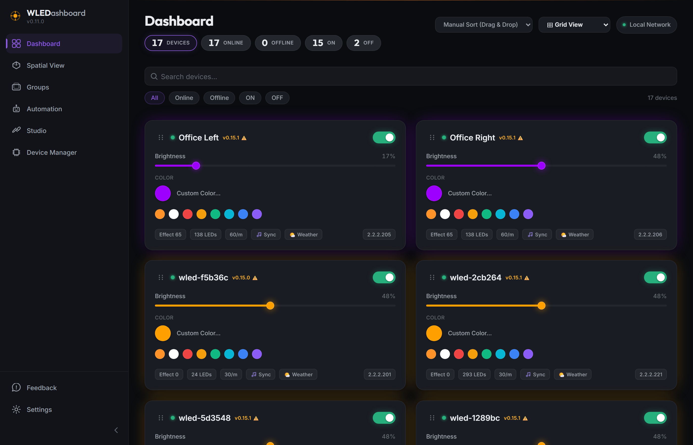
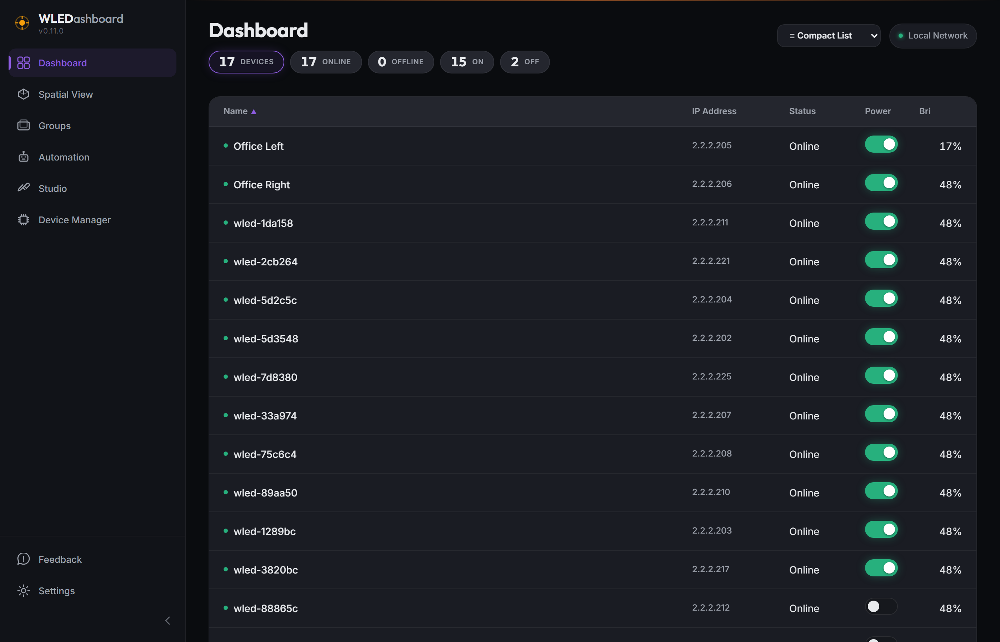
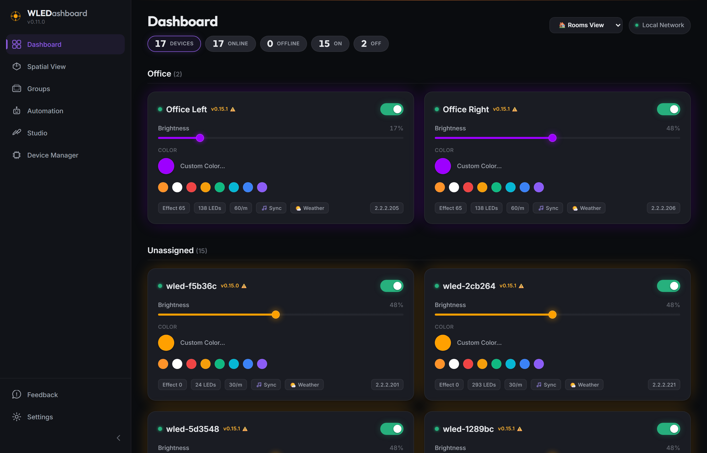
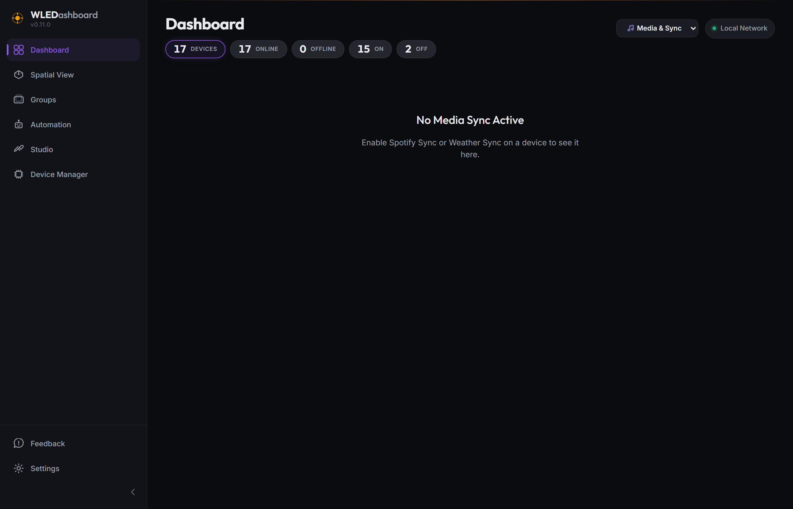

# WLEDashboard v0.12.0 Changelog

## Overview

This release introduces significant enhancements to the Dashboard's scale and organization, adds a robust multi-stage Docker deployment pipeline, and integrates full Weather Sync capabilities to drive ambient WLED effects based on live meteorological data!

## Key Features & Improvements

### Multi-View Dashboard System
The dashboard has been upgraded from a simple toggle to a powerful dropdown view selector designed for power users managing larger deployments:
* **Compact List View:** A high-density data table allowing you to sort your WLED devices bidirectionally by Name, IP, Status, Power, or Brightness.
* **Rooms View:** Automatically scans your 3D Spatial Hierarchy and groups your dashboard device cards under physical locations (e.g. Living Room, Bedroom).
* **Media & Sync View:** Isolates all devices currently running dynamic WLED-SR audio effects, Spotify Sync, or the new Weather Sync.
* **Favorites View:** A dedicated dashboard for your most-used devices. Devices can now be pinned via their individual option menus (•••).

### Weather Sync Integration
* Connect OpenWeatherMap directly in Settings.
* WLEDashboard will now automatically reflect live local weather conditions using vibrant WLED ambient effects (e.g. pulsing deep blue for rain, shimmering amber for sunset).

### Drag-and-Drop Visual Overhaul
* Added a dedicated 6-dot grip handle to device cards during "Manual Sort" mode to clearly indicate grab areas and prevent accidental slider/toggle clicks.
* Resolved CSS Grid constraints and animation locking: the dashboard grid now perfectly provides smooth, instant 2D sliding feedback to indicate exactly where your dropped card will land.

### Docker & CI/CD Pipeline
* Implemented a full multi-stage Docker build pipeline (`node:22-alpine`).
* Persistent SQLite databases mount seamlessly via `/app/data` volumes.
* Configured automated GitHub Actions workflows to publish `ghcr.io` builds instantly on version tags.

### Quality of Life
* The app version is now programmatically synchronized via Vite build variables, ensuring Settings and the Sidebar are always accurate.
* Upgraded sidebar iconography (Devices, Automation, Studio).
* Linked `wledashboard.com` directly in the Settings About section.

## Media Highlights

### Grid View (Default)

### Compact Data Table

### Rooms View (Spatial Grouping)

### Media & Sync View

