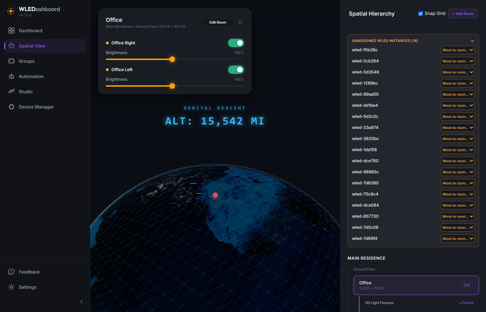
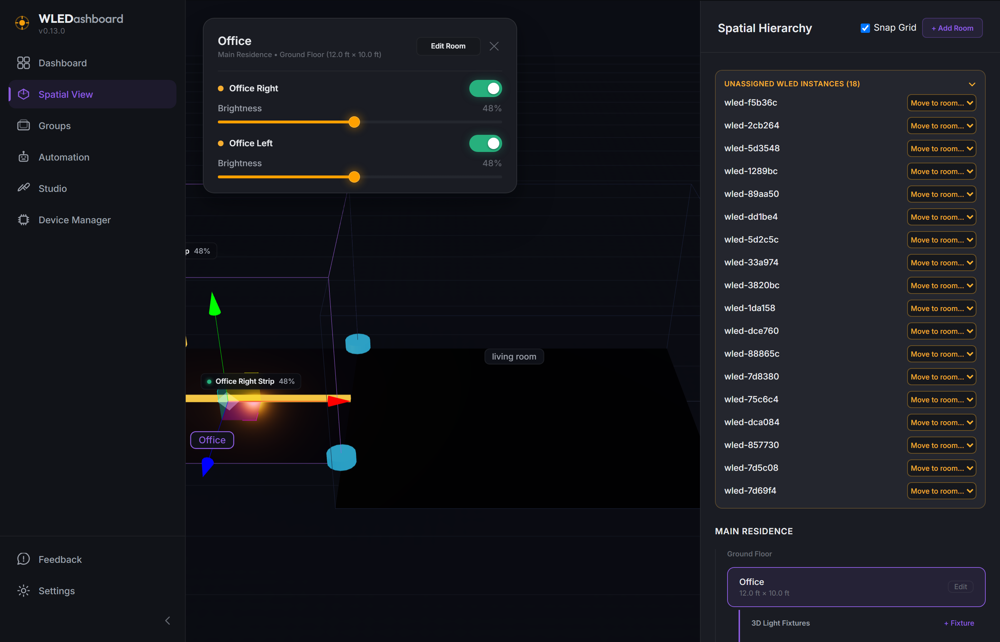
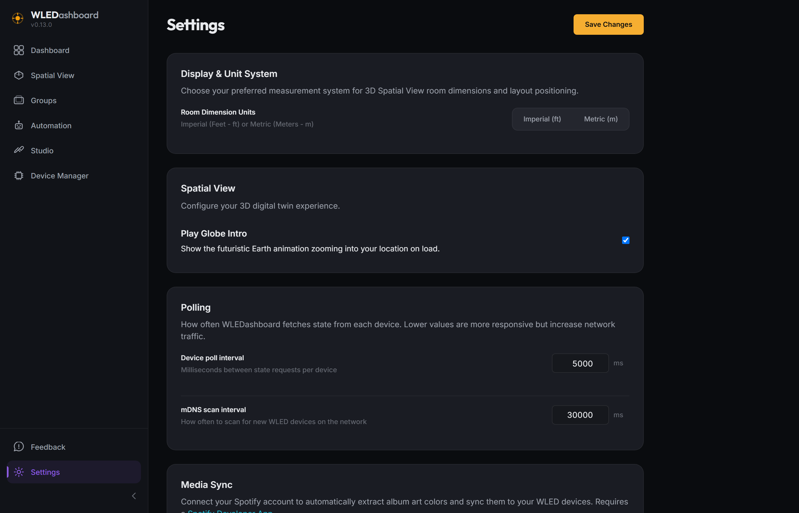

# WLEDashboard v0.13.0

## What's New

### Holographic Spatial Intro

* Replaced the standard spatial view loading state with a visually stunning 3D holographic Earth intro sequence.
* High-resolution night-time Earth textures, complete with glowing city lights and an emissive atmosphere.
* Uses your configured Latitude/Longitude to accurately position a geolocation ping marker.
* Calculates a dynamic camera trajectory to swoop down from orbit perfectly onto your location's surface coordinates.
* HUD Altimeter overlay accurately calculates your descent altitude from geostationary orbit down to ground level in real-time.

### Overhauled Room Controls

* Entirely removed the clunky `TransformControls` hover rings for 3D room rotation.
* Implemented new custom 3D direct-grab corner rotation handles.
* Seamless magnetic room snapping and 3D collision detection are fully preserved while dragging rotation handles.
* Custom global interaction plane locks the camera's `OrbitControls` during rotation to ensure the background scene doesn't drift.

### Spotify Auth Re-engineered

* Fixed invalid redirect URI mismatches when accessing the dashboard via local insecure IP addresses instead of `localhost`.
* Added an animated copy-to-clipboard button and clear verbiage for the Spotify Developer Dashboard configuration.
* Dynamically detects the current origin network to generate accurate callback URLs on the fly.

### UI & Stability Polish
* Clicking rooms in the right-hand hierarchy panel now correctly toggles expand/collapse state.
* The "Unassigned Instances" list is now fully collapsible with an animated SVG caret matching the main sidebar styling.
* Added `RouteErrorBoundary` to catch UI crashes.
* Patched fatal React Three Fiber race conditions when rapidly switching views while holding transform controls.
