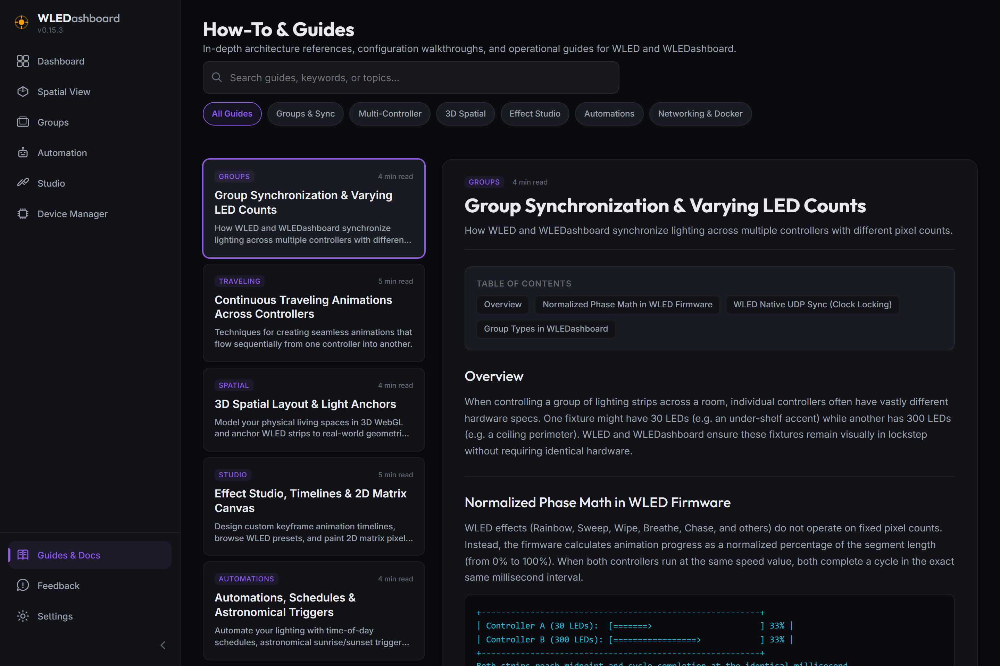
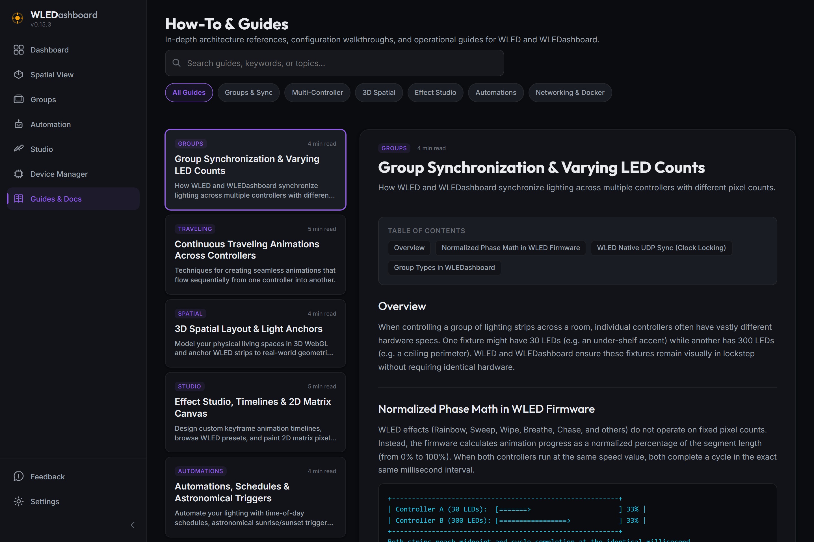
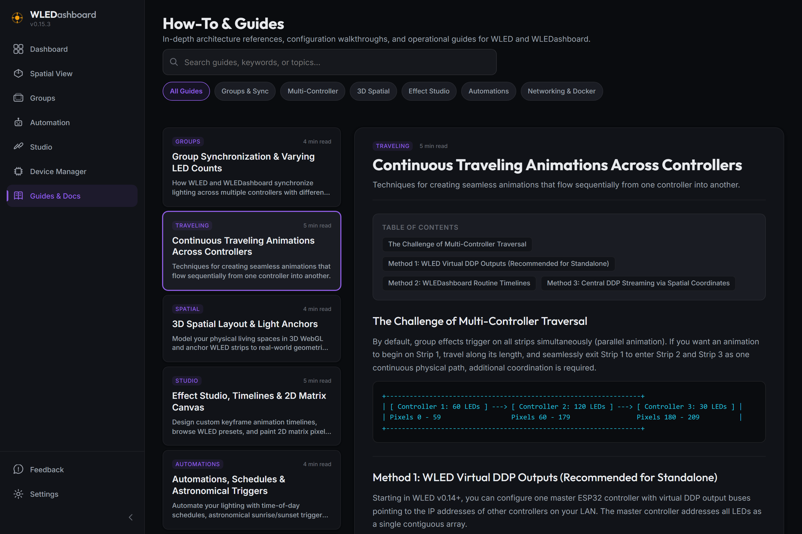
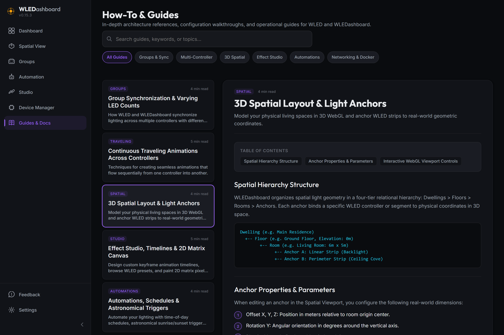

# v0.16.0 Release Walkthrough

## Summary
Version 0.16.0 introduces the **In-App Guides & Documentation Hub**, bringing comprehensive technical and operational documentation directly into the dashboard interface. This release also resolves critical reverse proxy and SSL WebSocket handshake exceptions encountered behind Nginx Proxy Manager and Cloudflare Tunnels, normalizes Spotify OAuth redirects across secure environments, and optimizes CI validation workflows.

---

## What Is New & Improved

### 1. In-App Guides & Documentation Hub (`/guides`)
* **Dedicated Navigation Hub:** Placed conveniently in the sidebar footer alongside Feedback and Settings for easy access across all screen sizes.
* **Filterable Knowledge Base:** Categorized topics covering Group Synchronization, Continuous Traveling Waves, 3D Spatial Layout & Anchors, Effect Studio & Timelines, Automations & SunCalc Triggers, and Docker Network Architecture.
* **Interactive UI Features:** Real-time search query filtering, category filter pills, sticky table of contents navigation, ASCII flow architecture diagrams, and one-click code copy buttons.
* **Contextual Deep-Links:** Contextual help links embedded throughout the application (Groups, Spatial Layout, Studio, Automations) linking directly to relevant documentation topics.

### 2. Reverse Proxy, HTTPS & WebSocket Resilience
* **Dynamic Protocol Detection:** Replaced hardcoded `ws://` with runtime protocol inspection (`window.location.protocol === 'https:' ? 'wss:' : 'ws:'`) in `useDeviceWebSocket.js` to eliminate browser Mixed Content security blocks (`Failed to construct 'WebSocket'`).
* **Origin and Port Normalization:** Removed hardcoded `:3001` port specification on the client WebSocket connection, allowing standard reverse proxy HTTPS traffic on port 443 to route to container instances seamlessly.
* **Error Boundary Protection:** Wrapped WebSocket instantiation in protective `try...catch` blocks with exponential backoff retry scheduling, preventing uncaught browser DOMExceptions from crashing the React view hierarchy.
* **Spotify OAuth Proxy Normalization:** Updated Spotify redirect URI generation to dynamically use `window.location.origin` over HTTPS, preventing internal container ports from appearing in external OAuth redirect URIs.
* **Reverse Proxy Documentation:** Added operational deployment steps for Nginx Proxy Manager (toggling Websockets Support) and Cloudflare Tunnel Zero Trust auth passing.

### 3. CI/CD & Repository Stability
* **HACS Validation Workflow:** Added `continue-on-error` tolerance on proprietary license checks in `.github/workflows/hacs-validation.yml` to prevent non-blocking upstream validation differences from failing deployment pipelines.

---

## Migration & Operational Instructions
* **Nginx Proxy Manager Users:** In your Proxy Host configuration for WLEDashboard, ensure the **Websockets Support** toggle is enabled under the Details tab to allow HTTP `Upgrade` headers through to port 3001.
* **Cloudflare Tunnel Users:** WebSocket connections route through standard HTTPS tunnels out of the box with zero custom port forwarding required.
