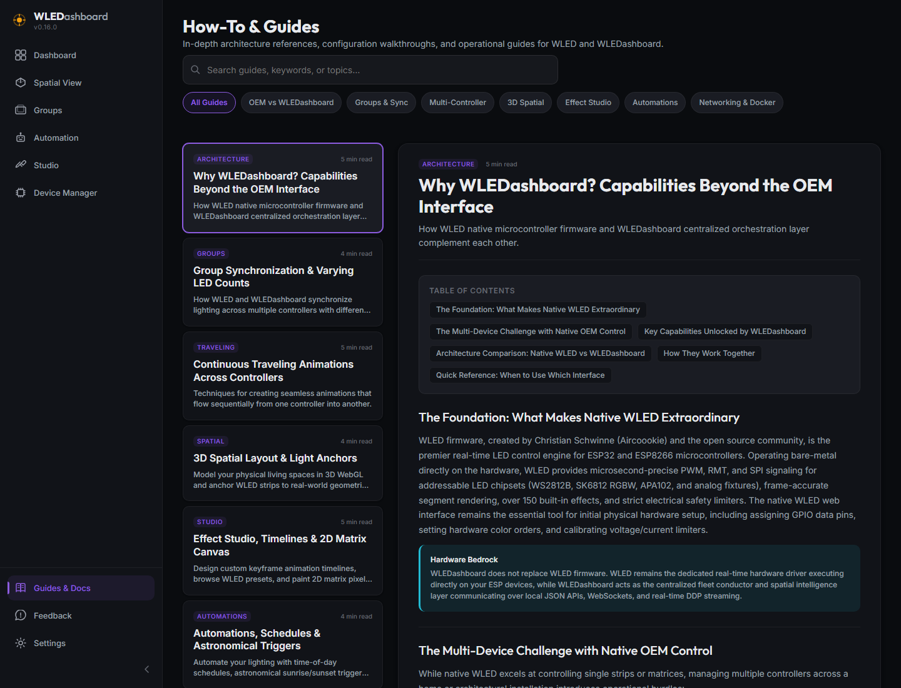
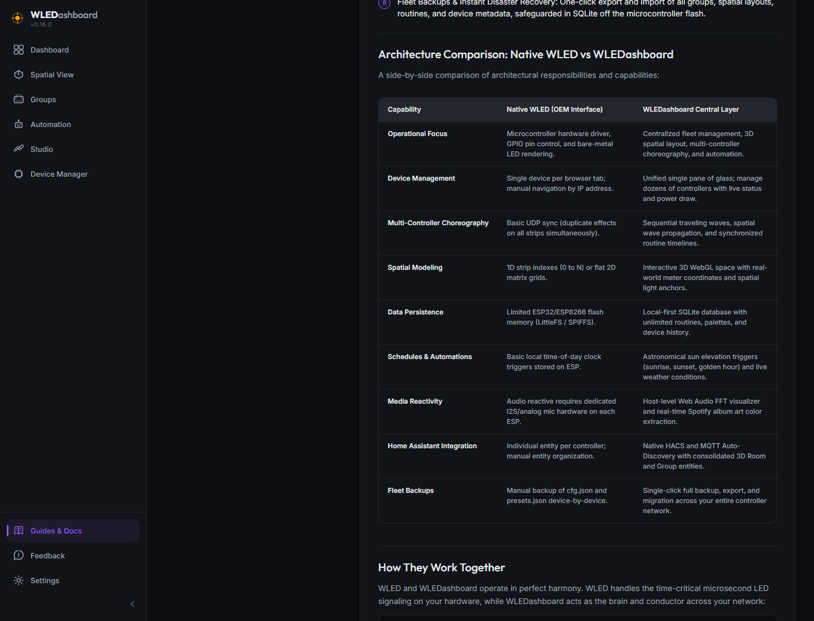
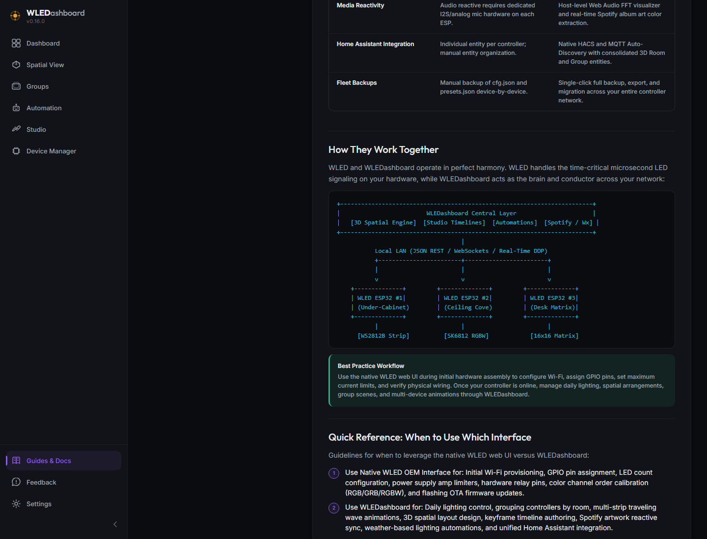

# v0.17.0 Release Walkthrough

## Summary
Version 0.17.0 expands the **How-To & Guides** hub with the **"Why WLEDashboard? Capabilities Beyond the OEM Interface"** architectural guide and introduces interactive table rendering to the Guides interface. This guide highlights the complementary roles of native WLED microcontroller firmware and WLEDashboard's centralized fleet orchestration layer.

---

## What Is New & Improved

### 1. Architectural Capabilities Guide
* **Hardware Bedrock Recognition:** Acknowledges WLED firmware as the premier bare-metal real-time LED control engine for ESP32 and ESP8266 microcontrollers, highlighting its indispensable role in hardware-level PWM/RMT signal generation and electrical safety limiters.
* **The Multi-Device Challenge:** Documents the operational friction of managing multiple individual controllers across separate browser tabs, isolated IP addresses, and microcontrollers with constrained flash memory (LittleFS / SPIFFS).
* **Capabilities Beyond OEM:** Details the core platform capabilities introduced by WLEDashboard:
  * Single pane of glass multi-controller fleet management and real-time telemetry.
  * 3D spatial layout modeling with metric dimensions and virtual light anchors.
  * Continuous multi-controller traveling waves and sequential routine delays.
  * Studio keyframe timeline authoring and 2D pixel matrix canvas with Web Audio FFT reactivity.
  * Off-device SQLite persistence and astronomical (SunCalc) / meteorological automations.
  * Real-time Spotify album art dominant color extraction.
  * Unified Home Assistant integration over native HACS and MQTT Auto-Discovery.
  * Instant single-click fleet backup and disaster recovery.

### 2. Interactive Comparison Matrix & Table Rendering
* **Table Component:** Implemented responsive dark-mode table rendering (`sec.table`) in the Guides view with customized typography, zebra-hover states, and horizontal scroll handling.
* **Side-by-Side Matrix:** A detailed matrix contrasting native WLED OEM responsibilities with WLEDashboard across operational focus, device management, spatial modeling, persistence, and automation.

### 3. System Architecture Flow & Operational Guidance
* **System Architecture Flow:** Added an ASCII architecture flow diagram showing how WLEDashboard conductors the fleet over local JSON REST APIs, persistent WebSockets, and real-time DDP streaming.
* **Quick Reference Guide:** Actionable best-practice breakdown guiding users on when to use the native WLED web UI (initial hardware setup, GPIO pin assignments, current limits) versus WLEDashboard (daily lighting control, room groups, 3D spatial scenes, multi-device routines, automations).

---

## Operational Notes
* No database migrations or schema adjustments are required for this release.
* The new guide is accessible under the **Architecture & Capabilities** category in the in-app Guides view.
