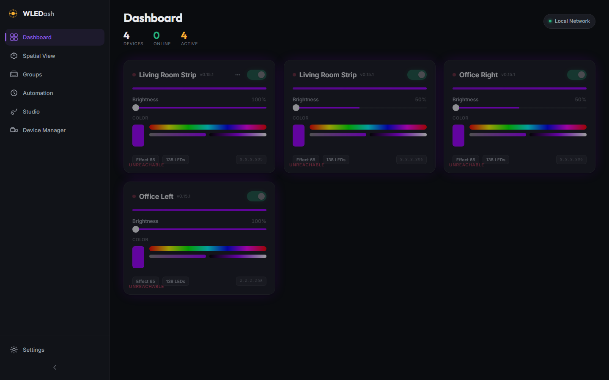
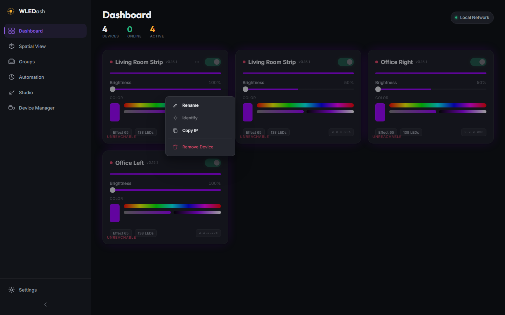
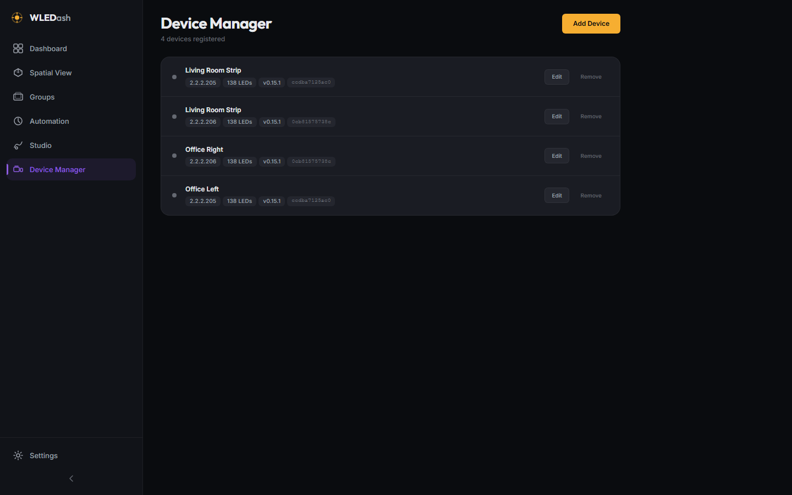
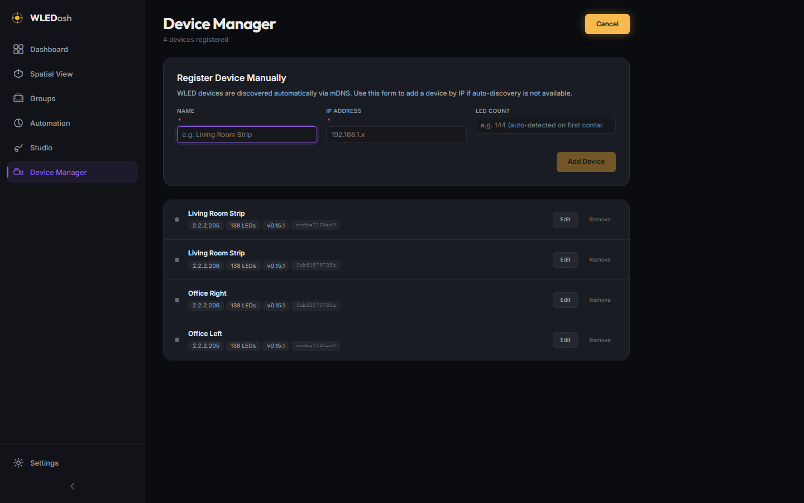
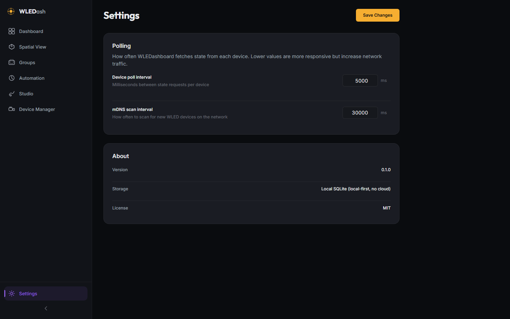

# v0.2.0 - Control Depth

**Released:** 2026-07-22

This release delivers Phase 2 of the WLEDashboard roadmap, focused on control depth and device management. Every device can now be renamed, identified, and removed directly from the dashboard. A dedicated Device Manager view handles full CRUD. Toast notifications provide feedback across all operations.

---

## Screenshots

### Dashboard

### Card Hover State

The three-dot menu button appears on hover. Right-clicking the card also opens the context menu.

### Context Menu

Right-click or use the three-dot button to access device actions inline.

### Device Manager

Full device list with inline edit, delete confirmation flow, and the Add Device form.

### Add Device Form

Manually register a device by IP. LED count, MAC address, and firmware version are auto-populated on first poll contact with a real device.

### Settings

Poll interval and mDNS scan interval are configurable and persisted to the API.

---

## What Changed

### New Features

* **Toast notification system** - Typed notifications (info/success/error/warning) with spring bounce entrance animation, left-border accent color, and auto-dismiss. Rendered via `ToastContainer` mounted globally in the app shell.

* **Device card context menu** - Right-click anywhere on a device card or click the three-dot button (appears on hover) to access:
  * Rename (also available via double-click on the device name)
  * Identify (flashes the strip solid white at full brightness for 3 seconds, then restores prior state)
  * Copy IP to clipboard
  * Remove Device (with toast confirmation)

* **Device Manager view** (`/devices`) - Dedicated management interface with:
  * Full device list showing online status, IP, LED count, firmware version, and MAC address
  * Inline edit form for name, IP address, and LED count
  * Two-step delete confirmation (click Remove, confirm in highlighted row)
  * Add Device form with validation (name and IP required; LED count optional, auto-detected on first poll)

* **Settings view** (`/settings`) - Configurable parameters persisted to the API database:
  * Device poll interval (1000-60000ms, default 5000ms)
  * mDNS scan interval (5000-300000ms, default 30000ms)
  * About section showing version and storage details

* **Dashboard search and filter** (auto-shows when more than 4 devices are registered):
  * Full-text search by device name or IP address (200ms debounce)
  * Status filter chips: All / Online / Offline
  * Live result count
  * "No matches" empty state with clear-filters action

* **Drag-to-reorder device cards** - dnd-kit integration with 8px activation distance threshold to prevent accidental reorders when clicking controls inside cards. Order persisted to API via `/api/devices/reorder`.

* **Device Manager nav item** added to sidebar with a custom inline SVG icon.

### Improvements

* **Auto-enrichment on first poll** - Passing only name and IP when registering a device is now sufficient. The polling engine writes MAC address, firmware version, and LED count back from `/json/info` on first successful contact. Existing values are preserved (COALESCE logic).

* **Firmware version in device card** - Now shows `v{firmware_ver}` if populated (previously only shown from live state info).

### Bug Fixes

* `useEffect` missing from `DeviceCard` React import (caused crash on first device load)
* `pino-pretty` transport now guarded behind `IS_PROD` flag so the API server starts correctly in development
* Rename Escape key unreliable when input focus raced with `setTimeout` select -- replaced `onKeyDown` with a document-level listener mounted only while rename is active

---

## Files Changed

* `apps/web/src/components/Toast/Toast.jsx` - New
* `apps/web/src/components/Toast/Toast.module.css` - New
* `apps/web/src/components/ContextMenu/ContextMenu.jsx` - New
* `apps/web/src/components/ContextMenu/ContextMenu.module.css` - New
* `apps/web/src/components/SearchBar/SearchBar.jsx` - New
* `apps/web/src/components/SearchBar/SearchBar.module.css` - New
* `apps/web/src/components/DeviceCard/DeviceCard.jsx` - Rewritten (context menu, rename, identify, portal)
* `apps/web/src/components/DeviceCard/DeviceCard.module.css` - Updated (menu button, rename input styles)
* `apps/web/src/components/Sidebar/Sidebar.jsx` - Updated (Device Manager nav item)
* `apps/web/src/views/Dashboard/Dashboard.jsx` - Rewritten (search, filter, dnd-kit reorder)
* `apps/web/src/views/Settings/Settings.jsx` - New
* `apps/web/src/views/Settings/Settings.module.css` - New
* `apps/web/src/views/DeviceManager/DeviceManager.jsx` - New
* `apps/web/src/views/DeviceManager/DeviceManager.module.css` - New
* `apps/web/src/layouts/AppLayout.jsx` - Updated (ToastContainer mounted globally)
* `apps/web/src/router/router.jsx` - Updated (Settings and DeviceManager routes wired)
* `apps/api/src/services/deviceService.js` - Updated (auto-enrichment on first poll)
* `apps/api/src/server.js` - Updated (pino-pretty production guard)
* `project_details/playbooks/screenshot-v0.2.0.js` - New (Playwright screenshot automation)
