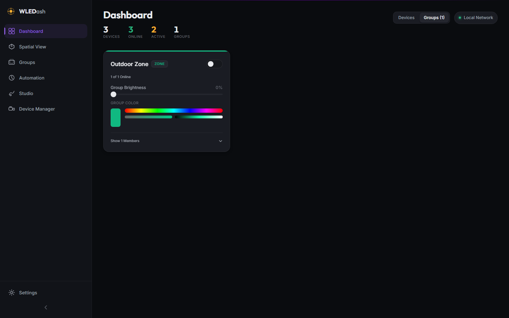

# v0.3.0 - Organization (Groups & Backups)

**Released:** 2026-07-22

This release delivers Phase 3 of the WLEDashboard roadmap, introducing complete Group Management (zones, scenes, sync arrays, and custom clusters), recursive group hierarchy resolution, group control dispatching, Dashboard group clustering, and JSON configuration export and import for full system backups.

---

## Screenshots

### Groups View

Full group list showing device member statistics, group types, accent bar indicators, group-wide power & brightness sliders, inline group color picker, expandable member device lists, and backup controls.

### Group Editor Modal

Create or edit groups with name, group type selector (Zone, Scene, Sync, Custom), curated accent color palette (or custom color picker), member device checkboxes, and nested child group selections.

### Dashboard Group Mode

Toggle the main Dashboard between flat device cards and group clusters for high-density control.

---

## What Changed

### New Features

* **Groups Engine & API**:
  * SQLite schema tables (`groups`, `group_members`, `group_children`) for full group hierarchy storage.
  * `groupService.js` with CRUD endpoints (`/api/groups`), group reordering, and recursive device resolution (including nested child groups).
  * Concurrent group command dispatch (`POST /api/groups/:id/command`), controlling power, brightness, color, and effects across all member devices simultaneously.

* **Groups View (`/groups`)**:
  * Responsive group card grid rendering all active groups.
  * Group filter bar by group type (Zone, Scene, Sync, Custom) and search input.
  * Group controls: group power toggle, average brightness slider, group color picker, and member device expander list.
  * Context menu and edit button launching the `GroupEditorModal`.

* **Group Editor Modal**:
  * Full creation and editing modal for groups.
  * Group type selector (Zone, Scene, Sync, Custom).
  * Color swatch palette with custom color picker.
  * Scrollable device member selection list.
  * Nested child group selection list (with self-nesting protection).

* **Dashboard Group Clustering**:
  * View mode toggle on the main Dashboard header (`Devices` vs `Groups`).
  * Instant switching between flat device cards and cluster cards.

* **JSON Configuration Backup & Restore (Export / Import)**:
  * `configService.js` and `/api/config/export` & `/api/config/import` routes.
  * Export complete dashboard state (devices, groups, members, children, settings, presets) to a timestamped JSON file (`wledashboard-backup-YYYY-MM-DD.json`).
  * Import backup file with option to merge or replace existing configuration.
  * Export & Import buttons integrated into the Groups View header.

* **Frontend Store & API Client Integration**:
  * `useGroupStore` Zustand store managing group state, optimistic updates, and group commands.
  * `groupsApi` and `configApi` added to the API client library (`apps/web/src/lib/api.js`).

---

## Files Changed

* `apps/api/src/services/groupService.js` - New (Group CRUD & recursive command execution)
* `apps/api/src/services/configService.js` - New (JSON backup export & import)
* `apps/api/src/routes/groups.js` - New (Group API endpoints with Zod validation)
* `apps/api/src/routes/config.js` - New (Config export/import API endpoints)
* `apps/api/src/server.js` - Updated (Registered group & config routes)
* `apps/web/src/lib/api.js` - Updated (Added groupsApi and configApi)
* `apps/web/src/stores/groupStore.js` - New (Zustand group store)
* `apps/web/src/components/GroupCard/GroupCard.jsx` - New (Group control card component)
* `apps/web/src/components/GroupCard/GroupCard.module.css` - New
* `apps/web/src/components/GroupEditorModal/GroupEditorModal.jsx` - New (Group edit modal)
* `apps/web/src/components/GroupEditorModal/GroupEditorModal.module.css` - New
* `apps/web/src/views/Groups/Groups.jsx` - New (Groups view page with backup controls)
* `apps/web/src/views/Groups/Groups.module.css` - New
* `apps/web/src/views/Dashboard/Dashboard.jsx` - Updated (Added Group Clustering mode toggle)
* `apps/web/src/views/Dashboard/Dashboard.module.css` - Updated (Added mode toggle styling)
* `apps/web/src/router/router.jsx` - Updated (Wired /groups route)
* `project_details/playbooks/test-v0.3.0.js` - New (15/15 passing functional test suite)
* `project_details/playbooks/screenshot-v0.3.0.js` - New (Playwright screenshot automation)
* `project_details/proof/v0.3.0/test-results.txt` - New (Verification proof artifact)
