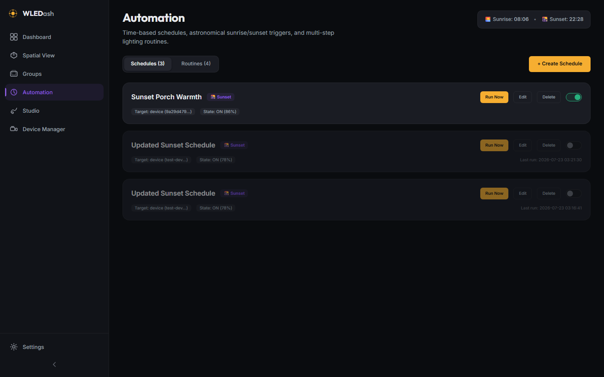
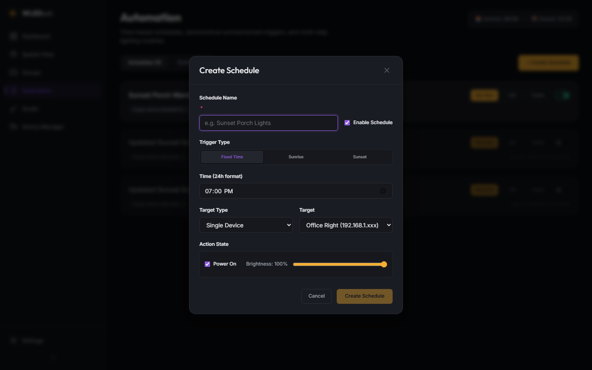
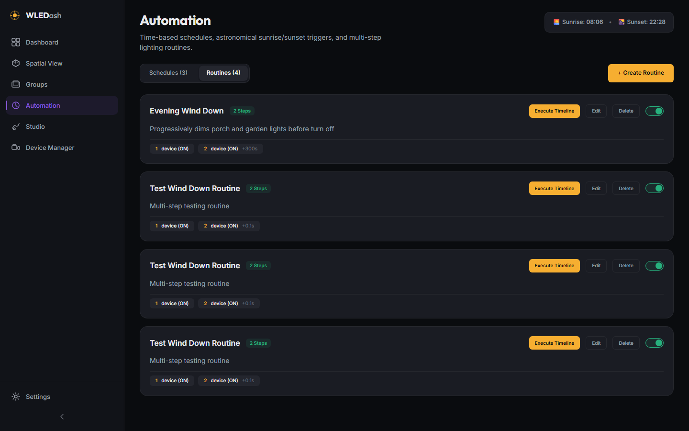
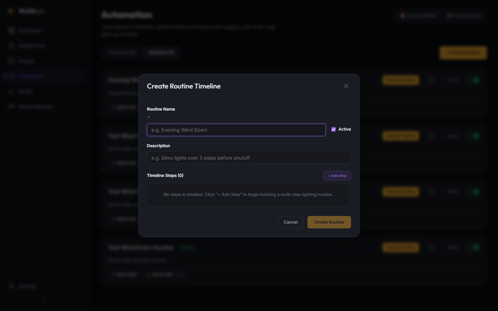

# v0.4.0 - Automation (Schedules & Routines)

**Released:** 2026-07-22

This release delivers Phase 4 of the WLEDashboard roadmap, introducing automated time-based schedules, astronomical sunrise/sunset calculations (`suncalc`), multi-step routine timelines with customizable delay intervals, and an active background automation execution engine.

---

## Screenshots

### Schedules View

Control active time-based, sunrise, and sunset schedules. Live astronomical sun times badge displayed in header.

### Schedule Editor Modal

Create or edit automated schedules with fixed time (24h) or astronomical triggers (sunrise/sunset), target devices or groups, power state, and target brightness.

### Routines View

Multi-step lighting timeline routines showing step counts, delay tags, and execution triggers.

### Routine Editor Modal

Interactive timeline step builder with customizable per-step target devices/groups, power state, brightness levels, and step delays.

---

## What Changed

### New Features

* **Automation Engine & Background Scheduler**:
  * `automationService.js` background scheduler loop running every 30 seconds to evaluate active schedule triggers against real-time and astronomical sun calculations.
  * `suncalc` integration for automatic local sunrise, sunset, dusk, and dawn calculations based on configurable latitude/longitude settings.
  * Sequential routine execution engine supporting multi-step timeline actions with delay intervals between steps.

* **Automation View (`/automation`)**:
  * Tabbed layout for managing **Schedules** and **Routines**.
  * Astronomical Sun Times badge in header showing local sunrise and sunset times.
  * Schedule cards displaying trigger type (Clock, Sunrise, Sunset), target device/group, power & brightness payload, last run timestamp, and enable/disable toggle.
  * Routine cards showing description, step count, timeline step previews, and instant execution buttons.

* **Schedule Editor Modal**:
  * Configure schedule name, status toggle, trigger type (Fixed Time, Sunrise, Sunset), target type (Device or Group), target selector, power state, and brightness slider.

* **Routine Editor Modal**:
  * Interactive step-by-step timeline builder. Add/remove steps dynamically, configure target device or group per step, power state, brightness slider, and delay before step in seconds.

* **Frontend Integration**:
  * `useAutomationStore` Zustand store managing schedule & routine state, CRUD operations, and execution triggers.
  * `automationApi` methods added to the frontend API client (`apps/web/src/lib/api.js`).

---

## Files Changed

* `apps/api/src/services/automationService.js` - New (Schedules, routines, SunCalc calculation, and background scheduler)
* `apps/api/src/routes/automation.js` - New (Automation API endpoints with Zod validation)
* `apps/api/src/db/database.js` - Updated (Added `migration_002` for automation schema columns)
* `apps/api/src/server.js` - Updated (Registered automation routes and background scheduler startup/shutdown)
* `apps/web/src/lib/api.js` - Updated (Added `automationApi`)
* `apps/web/src/stores/automationStore.js` - New (Zustand automation store)
* `apps/web/src/components/ScheduleEditorModal/ScheduleEditorModal.jsx` - New (Schedule editor modal)
* `apps/web/src/components/ScheduleEditorModal/ScheduleEditorModal.module.css` - New
* `apps/web/src/components/RoutineEditorModal/RoutineEditorModal.jsx` - New (Routine editor modal)
* `apps/web/src/components/RoutineEditorModal/RoutineEditorModal.module.css` - New
* `apps/web/src/views/Automation/Automation.jsx` - New (Automation view page with tabbed layout)
* `apps/web/src/views/Automation/Automation.module.css` - New
* `apps/web/src/router/router.jsx` - Updated (Wired `/automation` route)
* `project_details/playbooks/test-v0.4.0.js` - New (17/17 passing functional test suite)
* `project_details/playbooks/screenshot-v0.4.0.js` - New (Playwright screenshot automation with IP masking)
* `project_details/proof/v0.4.0/test-results.txt` - New (Verification proof artifact)
