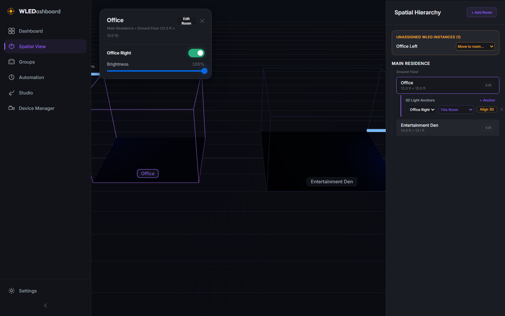
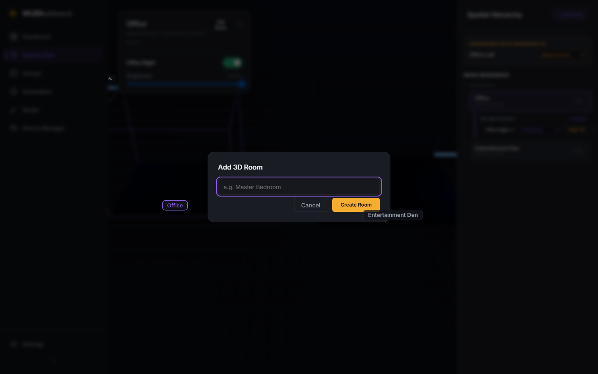

# v0.5.0 - Spatial View (3D Canvas & Room Engine)

**Released:** 2026-07-23

This release delivers Phase 5 of the WLEDashboard roadmap, introducing an interactive 3D Spatial Viewport powered by Three.js and React Three Fiber (`@react-three/fiber`, `@react-three/drei`), procedural 3D room geometries, real-time emissive light strip material rendering, spatial hierarchy side management, and device-to-anchor spatial bindings.

---

## Screenshots

### 3D Spatial Viewport

Interactive 3D floor plan viewport with smooth OrbitControls camera damping, wireframe room boundaries, ground grid, contact shadows, and real-time emissive LED light strips.

### Selected 3D Room & Quick Controls

Selecting a room or 3D light strip displays an interactive floating control overlay for real-time power toggling, brightness adjustments, and color state previews.

### Add 3D Room Modal

Add new 3D rooms to floor plans with custom dimensions, positions, and light anchor placements.

---

## What Changed

### New Features

* **Three.js & React Three Fiber Viewport (`SpatialCanvas.jsx`)**:
  * WebGL 3D Canvas integration with smooth `OrbitControls` camera navigation, perspective view, ambient/directional lighting, and ground grid projection.
  * Procedural 3D room geometries rendering floor plans, wireframe wall boundaries, and 3D room name badges (`Html` overlay).
  * Real-time emissive 3D light strip meshes (`LightStripMesh`) with pulsing animations, dynamic point light emission, and real-time WLED color/brightness sync.

* **Spatial Hierarchy API & Backend (`spatialService.js` & `routes/spatial.js`)**:
  * SQLite storage tables (`dwellings`, `floors`, `rooms`, `anchors`).
  * Full CRUD endpoints (`/api/spatial/hierarchy`, `/api/spatial/rooms`, `/api/spatial/anchors`) for managing 3D spatial trees and device-to-3D-anchor bindings.
  * Automatic default spatial hierarchy seeding for new installations ("Main Residence" -> "Ground Floor" -> "Living Room", "Entertainment Den").

* **Spatial Hierarchy Side Panel**:
  * Tree view displaying Dwellings, Floors, Rooms, and 3D Light Anchors.
  * Inline WLED device binding selector dropdowns per anchor.
  * Interactive room selection and 3D focus.

* **Floating Quick Light Controls**:
  * Context-aware floating overlay panel displaying active bound WLED device controls (Power Toggle, Brightness Slider, Dominant Color) directly over the 3D viewport.

* **Frontend Store Integration**:
  * `useSpatialStore` Zustand store managing 3D hierarchy tree, room/anchor selection, and spatial CRUD.
  * `spatialApi` methods added to `apps/web/src/lib/api.js`.

---

## Files Changed

* `apps/api/src/services/spatialService.js` - New (Spatial hierarchy CRUD & default seed fallback)
* `apps/api/src/routes/spatial.js` - New (Spatial API endpoints with Zod validation)
* `apps/api/src/server.js` - Updated (Registered `spatialRoutes`)
* `apps/web/package.json` - Updated (Added `three`, `@react-three/fiber`, `@react-three/drei`)
* `apps/web/src/lib/api.js` - Updated (Added `spatialApi`)
* `apps/web/src/stores/spatialStore.js` - New (Zustand spatial store)
* `apps/web/src/views/SpatialView/SpatialCanvas.jsx` - New (3D R3F Canvas, rooms, emissive light strip meshes)
* `apps/web/src/views/SpatialView/SpatialView.jsx` - New (Spatial View page, side hierarchy panel, floating control overlay)
* `apps/web/src/views/SpatialView/SpatialView.module.css` - New
* `apps/web/src/router/router.jsx` - Updated (Wired `/spatial` route)
* `project_details/playbooks/test-v0.5.0.js` - New (9/9 passing functional test suite)
* `project_details/playbooks/screenshot-v0.5.0.js` - New (Playwright screenshot automation with IP masking)
* `project_details/proof/v0.5.0/test-results.txt` - New (Verification proof artifact)
