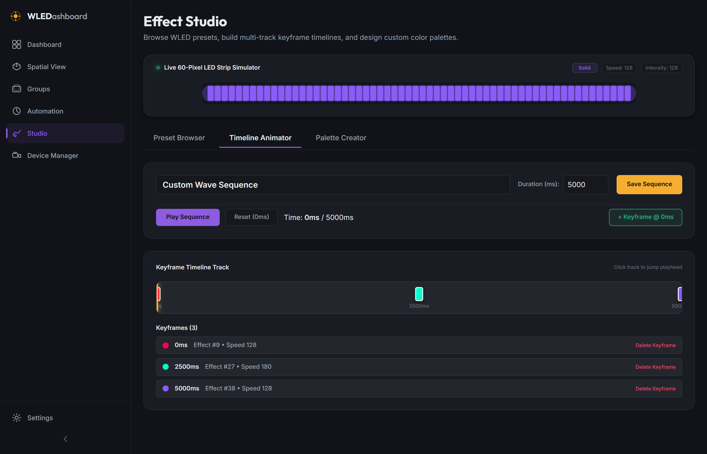
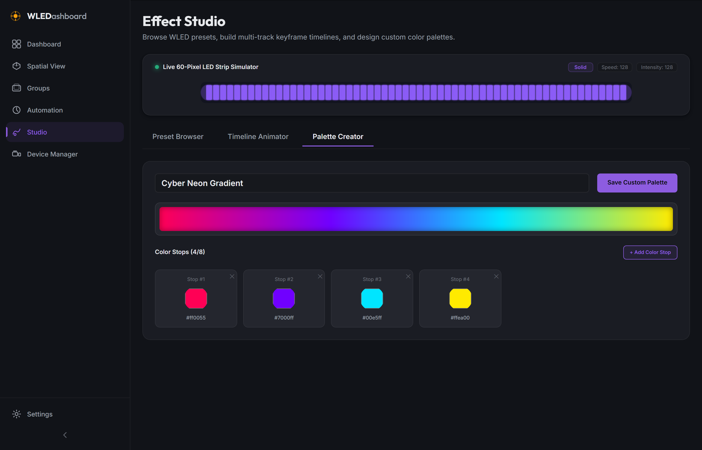

# WLEDashboard v0.6.0 Changelog

## Phase 6: Effect Studio

Release Date: July 24, 2026

### Overview

WLEDashboard v0.6.0 introduces Phase 6 (Effect Studio), adding a full-featured lighting design suite for browsing WLED built-in effects, building custom multi-track keyframe animation timelines, and designing custom multi-stop color palettes with live 60-pixel LED simulator playback.

---

### Key Features Added

* **60-Pixel LED Strip Simulator Canvas (`PixelStripCanvas.jsx`)**: HTML5 Canvas pixel strip renderer showing real-time animation effects (Solid, Blink, Breathe, Wipe, Rainbow, Colorloop, Chase, Fire 2012, Twinkle) with live speed and intensity parameters.
* **WLED Preset Browser (`PresetBrowser.jsx`)**: Effect catalog categorized by Basic, Dynamic, Fire, Festive, and Nature with real-time speed and intensity tuning sliders, WLED palette dropdown, primary color picker, and instant "Apply Live Config to Target Device / Group" dropdowns.
* **Keyframe Timeline Animator (`TimelineEditor.jsx`)**: Interactive multi-track timeline keyframe sequence builder with scrub bar, playhead playback controls (Play, Pause, Reset), keyframe inspector list, and SQLite database persistence for custom timeline animations.
* **Gradient Palette Creator (`PaletteDesigner.jsx`)**: Multi-stop linear gradient editor supporting up to 8 color stops, interactive HEX color pickers, real-time gradient bar previews, and custom palette library storage.
* **Studio API & Backend Engine (`studioService.js` & `routes/studio.js`)**: Endpoints for fetching WLED effect catalogs, built-in palette catalogs, custom keyframe animation CRUD, and custom palette design CRUD.
* **Automated Functional Testing & Screenshot Proofs**: 7/7 passing Playwright test suite (`test-v0.6.0.js`) and screenshot generation (`screenshot-v0.6.0.js`).

---

### Screenshots

* **Preset Browser Tab**:
  

* **Timeline Animator Tab**:
  

* **Palette Creator Tab**:
  
