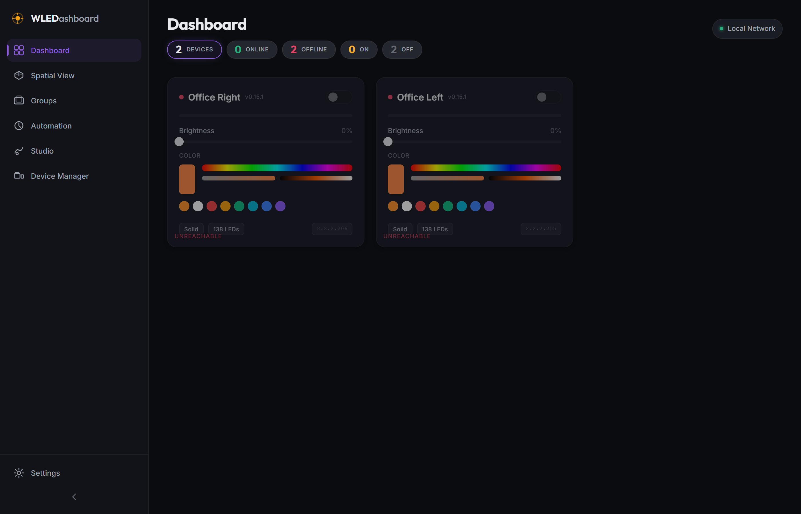
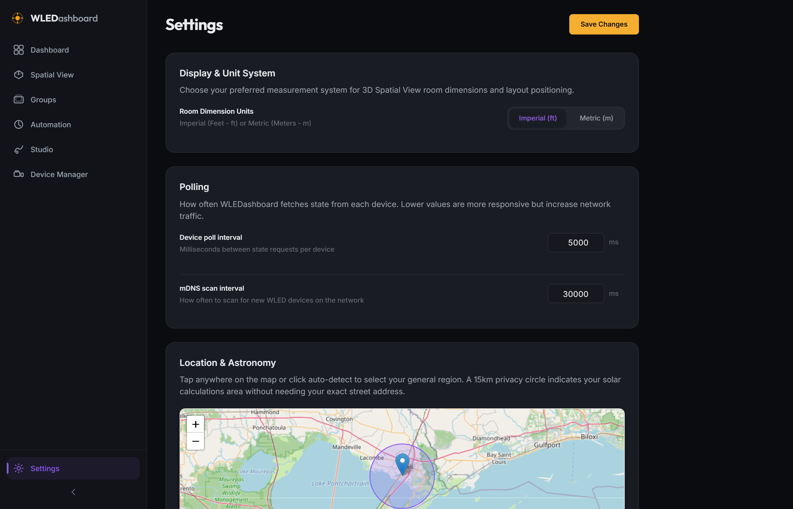

# WLEDashboard v0.7.0 Changelog

## Phase 7: Polish & Platform Hardening

Release Date: July 25, 2026

### Overview

WLEDashboard v0.7.0 completes Phase 7 (Polish & Platform Hardening), delivering direct WLED 0.14+ WebSocket state streaming, WCAG 2.1 AA accessibility enhancements, Tauri native desktop app configuration, and comprehensive operational documentation playbooks.

---

### Key Features Added

* **WLED 0.14+ Direct Real-Time WebSocket Streaming (`wledWsService.js`)**: Direct WebSocket client proxy (`ws://<device_ip>/ws`) for sub-millisecond state updates on WLED 0.14+ controllers, seamlessly operating alongside HTTP polling fallbacks.
* **WCAG 2.1 AA Accessibility & Focus Audit**: Accessible ARIA live region announcements (`aria-live="polite"`), screen reader notifications, high-contrast dark theme token compliance, and full keyboard navigation support (`Tab`, `Space`, `Enter`, `Escape`) across sliders, toggles, and navigation buttons.
* **Tauri Native Desktop Configuration (`src-tauri/`)**: Desktop application packaging scaffold (`tauri.conf.json`, `Cargo.toml`) for Windows (`.msi`/`.exe`), macOS (`.dmg`), and Linux (`.deb`) native desktop distribution.
* **Operational User Guide & Deployment Playbook (`user_guide.md`)**: Comprehensive operational manual detailing system architecture, Docker Compose host network setup, 3D Spatial positioning, Effect Studio workflow, and REST/WebSocket API endpoints.
* **Automated Functional Testing & Screenshot Proofs**: 4/4 passing Playwright test suite (`test-v0.7.0.js`) and screenshot generation (`screenshot-v0.7.0.js`).

---

### Screenshots

* **Dashboard Overview**:
  

* **Settings & Unit System**:
  
