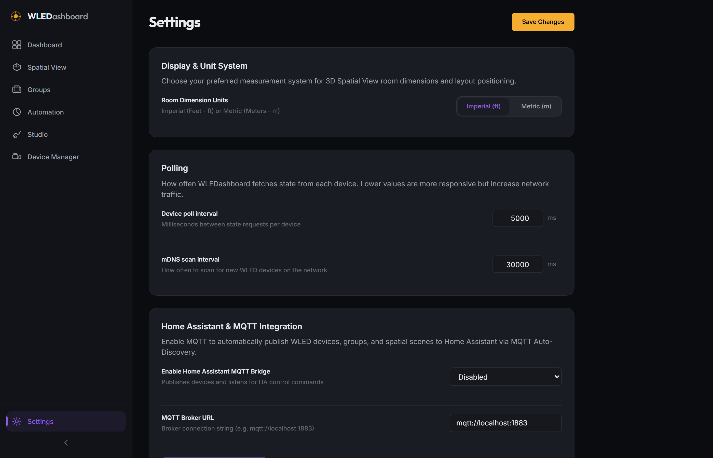
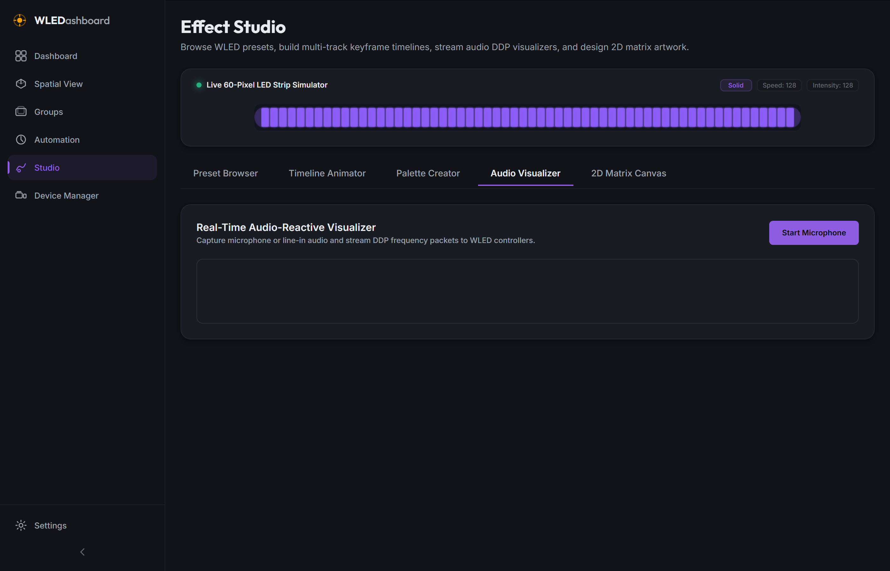
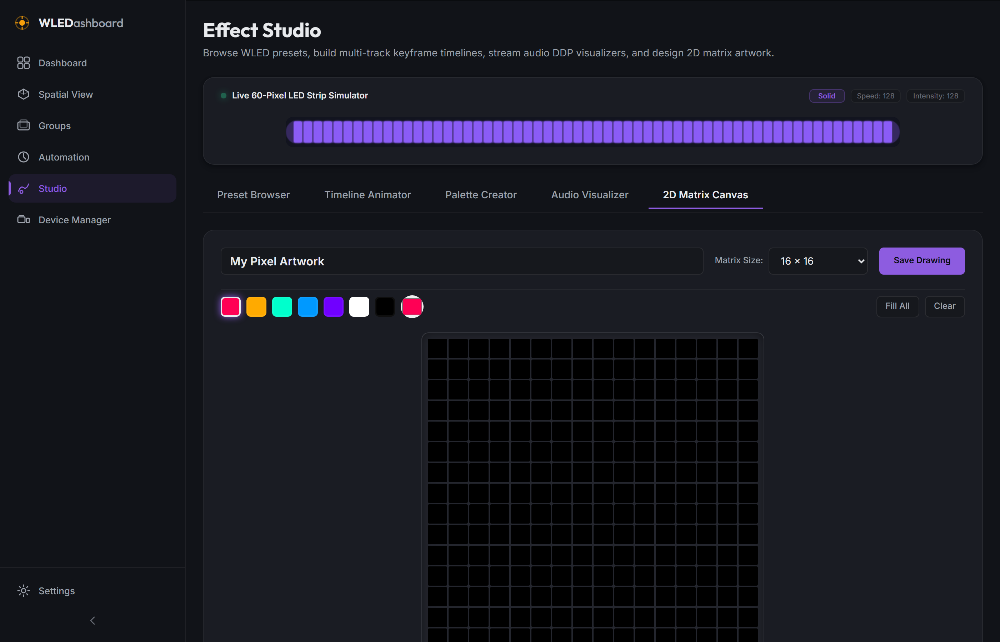

# WLEDashboard v0.8.0 Changelog

## Phase 8: Home Assistant MQTT Bridge, Real-Time Audio DDP Visualizer, and 2D Matrix Canvas

Release Date: July 25, 2026

### Overview

WLEDashboard v0.8.0 introduces three major features: a bi-directional Home Assistant MQTT integration bridge, real-time microphone FFT audio-reactive DDP packet streaming, and a 2D LED matrix pixel canvas editor.

---

### Key Features Added

* **Home Assistant & MQTT Integration Bridge (`mqttService.js` & `routes/mqtt.js`)**: Bi-directional MQTT client with Home Assistant MQTT Auto-Discovery payload publishing (`homeassistant/light/wledashboard_<id>/config`), MQTT command topics, and telemetry state updates.
* **Real-Time Audio-Reactive DDP Streaming (`AudioVisualizer.jsx` & `audioService.js`)**: Web Audio API microphone FFT frequency visualizer streaming real-time 40 FPS RGB DDP UDP packets directly to target WLED controllers.
* **2D LED Matrix Canvas Editor (`MatrixEditor.jsx` & `matrixService.js`)**: Multi-dimension matrix grid editor (8x8, 16x16, 32x8) with pixel pen tools, color bucket fill, preset swatches, clear tools, and SQLite drawing library persistence.
* **Settings & Studio Integration**: Home Assistant MQTT configuration panel in Settings (`/settings`) and dedicated Audio Visualizer & 2D Matrix Canvas tabs in Effect Studio (`/studio`).
* **Automated Functional Testing & Screenshot Proofs**: 7/7 passing Playwright test suite (`test-v0.8.0.js`) and screenshot generation (`screenshot-v0.8.0.js`).

---

### Screenshots

* **Home Assistant MQTT Integration**:
  

* **Real-Time Audio Visualizer**:
  

* **2D LED Matrix Canvas Editor**:
  
