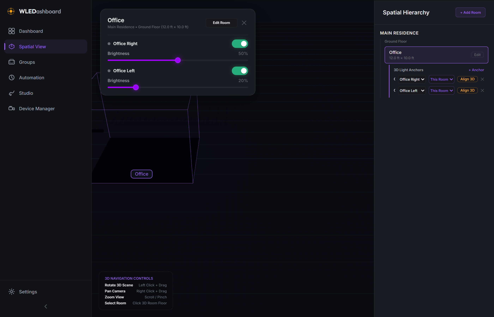
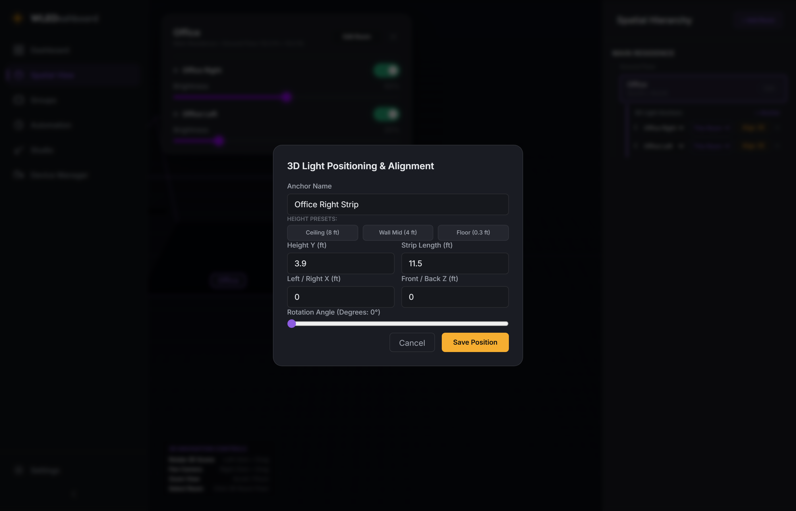

# WLEDashboard v0.9.0 Changelog

## Phase 9: Release Candidate / Beta Milestone & Spatial View Polish

Release Date: July 26, 2026

### Overview

WLEDashboard v0.9.0 marks the official Release Candidate (Beta) milestone ahead of 1.0.0 General Availability. This release consolidates all 8 feature phases and introduces crucial UI layout tuning, 3D Canvas element positioning fixes, and pointer event interactivity polish on the 3D Spatial View.

---

### Key Improvements & Fixes

* **Modal Overlay Layering & Drei Html Fix**: Raised `.modalOverlay` z-index to `100000` and scoped R3F Drei `<Html>` components to `zIndexRange={[10, 0]}`, preventing 3D room labels and light badges from clipping into modal dialogs.
* **Interactive Floating Room Card**: Fixed parameter handling in `useDeviceStore.sendCommand` and added pointer event stopPropagation to `.floatingPanel` so power toggles and brightness sliders are 100% interactive and conflict-free with 3D OrbitControls camera drags.
* **3D Navigation Controls Legend**: Added a sleek visual 3D controls shortcut badge to the Spatial View viewport (camera rotate, pan/translate, zoom, room selection).
* **Elongated Edit Room Button & Panel Widening**: Widened floating panel to 440px, styled `Edit Room` button on a single non-wrapping line, and added ellipsis truncation for long room metadata text.
* **Full Platform Consolidation**: Pre-release consolidation of Home Assistant MQTT Bridge, Real-Time Audio DDP Visualizer, 2D Matrix Canvas, 3D Spatial Hierarchy, Routine Automations, Group Clustering, and WLED 0.14+ WebSocket state streaming.

---

### Screenshots

* **Spatial View 3D Legend & Interactive Card**:
  

* **Spatial View Align 3D Light Modal**:
  
