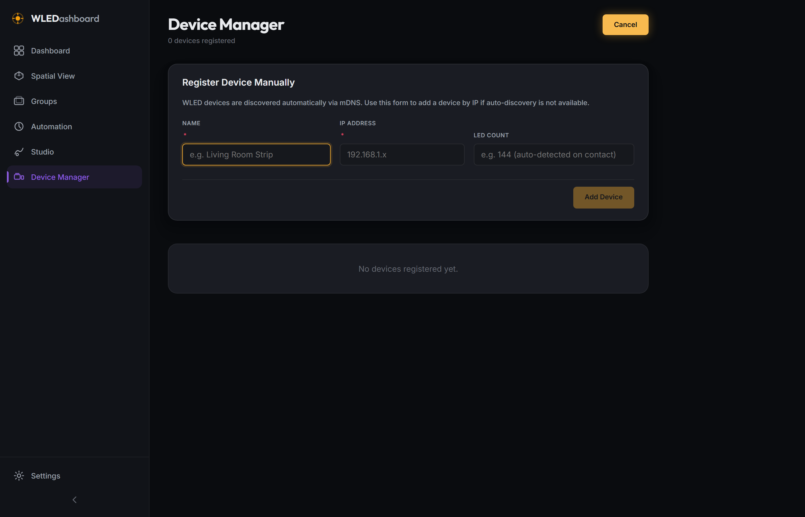

# WLEDashboard v0.9.0 Changelog

## Phase 9: Release Candidate / Beta Milestone & Hardware Control Polish

Release Date: July 26, 2026

### Overview

WLEDashboard v0.9.0 marks the official Release Candidate (Beta) milestone ahead of 1.0.0 General Availability. This release consolidates all pre-GA hardware brightness calibrations, single-event toggle stability fixes, color picker WLED solid mode updates, dynamic segment bar indicators, 3D Spatial View controls, and Device Manager spatial form alignments.

---

### Key Improvements & Fixes

* **Hardware-Calibrated WLED Brightness Floor (`colors.js`)**: Fact-based 5% linear threshold mapping (`raw WLED bri = 13`). Setting 1% on the UI now immediately illuminates physical LEDs at their lowest visible hardware threshold across 5V–24V PWM and addressable LED strips.
* **Power Toggle Single-Event Isolation (`Toggle.jsx`)**: Converted toggle container to an accessible `
` with event propagation guards, eliminating HTML `<label>` synthetic double-firing bugs and preventing toggles from snapping back ON.
* **Color Picker Solid Mode & Deep Segment Merging (`DeviceCard.jsx` & `deviceStore.js`)**: Updated color picker to explicitly dispatch `"fx": 0` (*Solid Mode*) and `"lor": 0` (*Live Override Reset*). Implemented deep segment array merging (`mergeLiveState`) in Zustand `deviceStore`, preventing card effect chips from flickering to "no effect".
* **Dynamic Segment Bar Standby & Glowing Color Sync (`SegmentBar.jsx`)**: Updated top segment bar on device cards to display active segment colors when powered on, and automatically dim to standby mode when powered off.
* **Spatial View 3D Legend & Modal Z-Index Polish (`SpatialView.jsx` & `SpatialCanvas.jsx`)**: Added visual 3D Navigation Controls shortcut legend to the Spatial View canvas, widened the floating room panel (440px), formatted the `Edit Room` button on a single line, and elevated modal overlay z-index to `100000` to prevent Three.js label clipping.
* **Device Manager Form Alignment (`DeviceManager.jsx` & `DeviceManager.module.css`)**: Re-proportioned the "Register Device Manually" card form grid (`1.2fr 0.9fr 1.3fr`), narrowing the IP address input, allocating 40% more space to the LED count input, and adding top/bottom margins and a dedicated 38px `Add Device` button footer row.

---

### Screenshots

* **Spatial View 3D Legend & Interactive Panel**:
  

* **Spatial View 3D Light Alignment Modal**:
  

* **Device Manager Manual Registration Form**:
  
